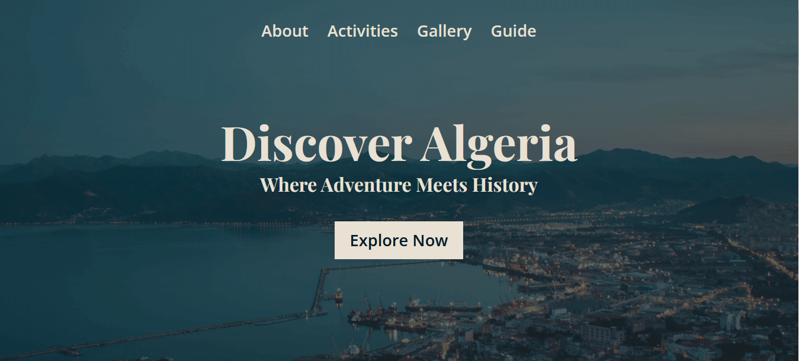

# discover-Algeria

## Table of Contents

- [discover-Algeria](#discover-algeria)
  - [Table of Contents](#table-of-contents)
  - [Project Overview](#project-overview)
  - [Demo](#demo)
  - [Technologies Used](#technologies-used)
  - [How to Use](#how-to-use)
  - [License](#license)

## Project Overview

This is a solo project completed as part of the Scrimba Front-End Path. It consists of a one-page website dedicated to showcasing the beauty and culture of Algeria, my home country.



## Demo

- Live demo: [Discover Algeria](https://discoveralgeria.netlify.app/)

## Technologies Used

The project utilizes the following technologies and features:

- HTML5
- CSS3
- Mobile-first design approach
- Responsive design to ensure compatibility across various devices and screen sizes.
- AOS - Animate on scroll library.
- PhotoSwipe JavaScript image gallery and lightbox.

## How to Use

1. **Clone the repository**:

First, you'll need to clone this repository to your local machine. Open your terminal and run the following command:

```git
git clone https://github.com/hichamweblog/discover-Algeria.git
```

2. **Navigate to the Project Folder**:

Change your working directory to the newly cloned project folder:

```git
 cd discover-Algeria
```

3. **Install Dependencies**:

Install the required packages by running:

```git
npm install
```

4. **Run the project**:

```git
npm run dev
```

This command will launch a development server, and you'll be able to view the website locally in your web browser.

## License

This project is licensed under the [MIT License](https://opensource.org/license/mit/).

